  

 

Hey! I'm a PhD student working at the intersection of molecular biology, computational chemistry, and scientific illustration.

- 🔬 &nbsp;Engineering enzymes through **directed evolution**
- 💻 &nbsp;Using **molecular modelling** to guide experimental design
- 🎨 &nbsp;Turning protein structures into **visual stories**

I care a lot about making science legible — to researchers, and to everyone else.

 

---

&nbsp;

&nbsp;

